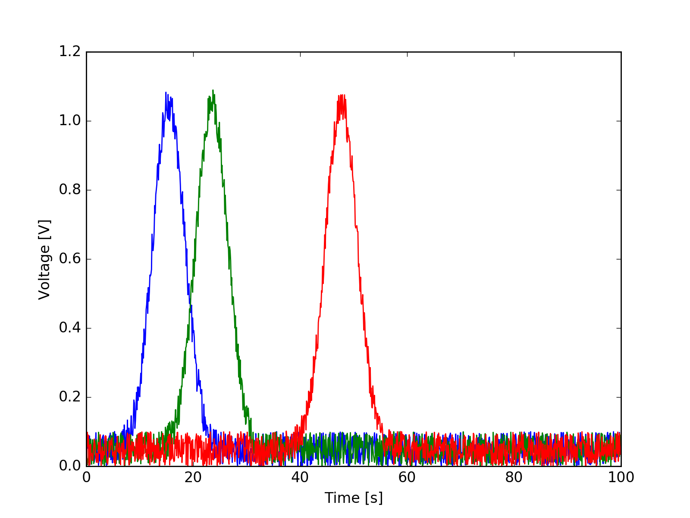

# rinobot-line-plot



Makes an line plot of xy or xyyy data.

If your data has many columns, this package will take the
first column as the x axis, and each subsequent column as
different y plots.

If you have a `data.txt` file with the following content

```
0.0 8.7
1.4 2.4
2.4 2.3
3.3 3.5
4.1 7.3
...
...
```

This plugin will make a png called `data-line-plot.png`

## Options:

In the extra args section of the rinobot automation config you can set the following parameters

- xmin: the minimum value of the x axis
- xmax: the max value of the x axis
- ymin: the minimum value of the y axis
- ymax: the max value of the y axis
- xlabel: the label for the x axis
- ylabel: the label for the y axis
