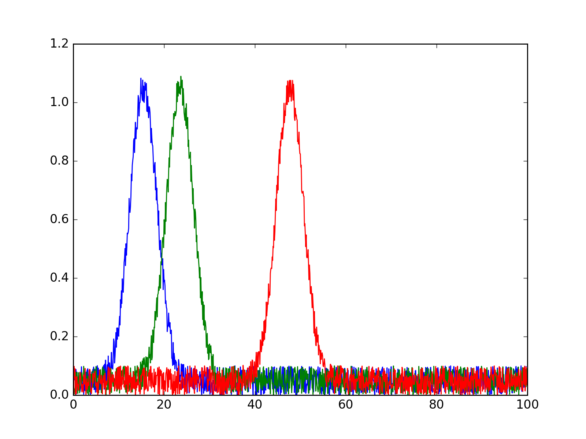

# rinobot-line-plot

Makes an line plot of xy or xyyy data.

So if your data has many columns, this package will take  the
first column as the x axis, and each subsequent column as
different y plots.

## Examples

If your data looks like

```
0.0 8.7
1.4 2.4
2.4 2.3
3.3 3.5
4.1 7.3
...
...
```

If will make an interactive html graph like:


